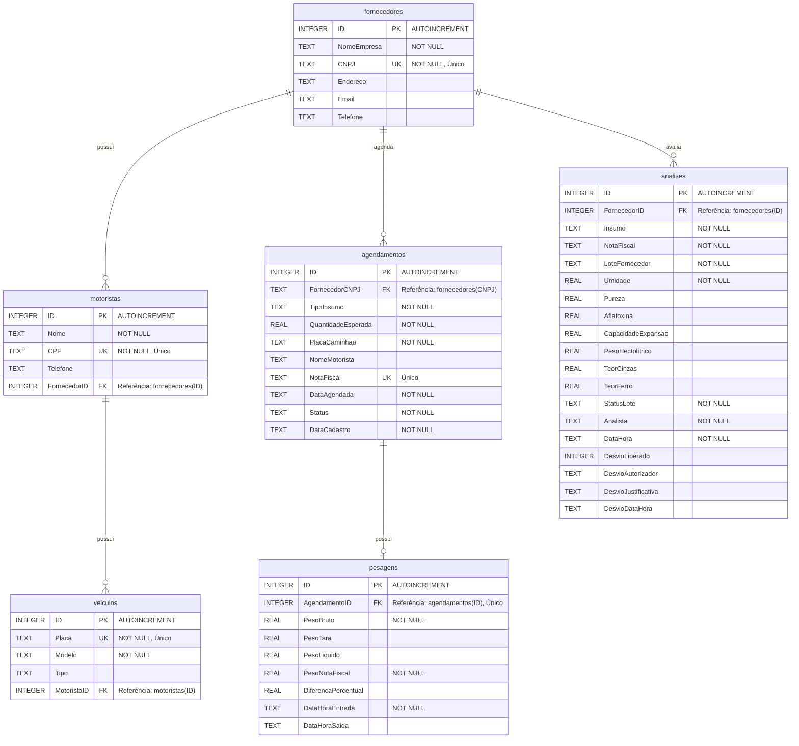

# 🏢 QUALIHUB - Sistema Integrado de Gestão da Qualidade e Recebimento

*Plataforma centralizada para automação, governança e integração do recebimento físico e regulatório de insumos na indústria alimentícia.*

---

[](https://www.python.org/)
[](https://streamlit.io/)
[](https://www.sqlite.org/)
[](https://pandas.pydata.org/)

---

### 🚀 **Aplicação em Nuvem**

**[Acesse a aplicação em produção aqui!](https://sistemaqualidade.streamlit.app/)**

---

### 📸 **Interface do Usuário**


---

## 📝 Sobre o Projeto

O **QualiHub** foi desenvolvido para resolver o problema clássico da descentralização de informações em pequenas e médias indústrias alimentícias. Substituindo planilhas paralelas e controles manuais em papel por um fluxo digital auditável, a plataforma unifica a operação logística, o laboratório físico-químico e a gestão administrativa da qualidade em um ecossistema integrado.

Ele cobre todo o ciclo de vida do recebimento:
1. **Credenciamento**: Autocadastro de fornecedores e controle restrito de suas frotas (motoristas/veículos).
2. **Planejamento**: Agendamento de janelas horárias com controle ativo de capacidade operacional de descarga.
3. **Triagem Logística**: Monitoramento em tempo real de portaria e docas com painel semanal e diário de fila.
4. **Laboratório e Conformidade**: Análise de parâmetros físico-químicos sob um motor de decisão inteligente e emissão de laudo certificado em HTML.
5. **Pesagem e Balança**: Aferição física de peso bruto, tara, peso líquido e conciliação de "quebras" contra a Nota Fiscal.
6. **Governança**: Liberação de lotes retidos sob desvios comerciais com descontos parametrizados ou reprovação imediata.
7. **Ecossistema e Integrações**: Leitura automática de XML de NF-e, importação de pedidos em CSV de ERPs e disparo de webhooks JSON em tempo real.

---

## 🗺️ Roadmap de Módulos e Funcionalidades

Todas as etapas essenciais do ecossistema de recebimento de insumos foram concluídas e testadas:

- [x] **Módulo 1: Cadastro de Fornecedores:** Autocadastro de parceiros comerciais com validação contra duplicidade de CNPJ e isolamento de onboarding de novos fornecedores.
- [x] **Módulo 2: Motoristas e Veículos:** Vínculo de motoristas e frotas de veículos. Validação de CPF e placas exclusivas com restrição de visibilidade para dados próprios de cada fornecedor logado.
- [x] **Módulo 3: Agendamento de Entregas:** Planejamento e reserva de janelas com controle visual em tempo real (barra de progresso) da capacidade máxima da planta por data.
- [x] **Módulo 4: Painel e Fila de Janelas:** Painel de portaria diário em cards coloridos estilizados por status regulatório/logístico e calendário semanal de programação.
- [x] **Módulo 5: Análise Físico-Química e Recebimento:** Coleta de múltiplos parâmetros por insumo, motor de decisão regulatório automático e emissão do Certificado de Qualidade com exportação HTML.
- [x] **Módulo 6: Controle de Pesagem (Balança):** Balança de entrada (Peso Bruto) e saída (Tara) com cálculo de peso líquido efetivo e diferença percentual de quebra em relação à Nota Fiscal.
- [x] **Módulo 7: Gestão e Liberação de Quarentena:** Painel administrativo restrito a gestores para autorização de lotes com desvio comercial e desconto financeiro, ou rejeição justificada com rastreamento auditável.
- [x] **Módulo 8: Hub de Integrações ERP:** Upload inteligente de XML de NF-e, importador de pedidos CSV do ERP, disparo simulado de Webhooks JSON de qualidade e especificações técnicas de API REST.

---

## 🗄️ Arquitetura do Banco de Dados

A aplicação utiliza um banco de dados relacional **SQLite** (`fornecedores.db`) configurado com restrições de chaves estrangeiras (`FOREIGN KEY`) e regras rígidas de integridade referencial. O banco executa migrações automáticas de schema ao iniciar.

### Diagrama Entidade-Relacionamento (ERD)



### Regras de Integridade e Validações
* **Isolamento de CNPJ:** O CNPJ de fornecedores deve ser único no sistema. O motor de busca realiza limpeza automática de pontuações no banco de dados.
* **Placas de Veículos:** Convertidas automaticamente para maiúsculas (`AAA1A11`). O sistema impede o cadastro da mesma placa para motoristas diferentes.
* **Nota Fiscal Exclusiva:** Cada agendamento exige uma Nota Fiscal única para barrar agendamentos duplicados.
* **Isolamento Multitenancy de Fornecedores:** Se um fornecedor acessa o sistema informando seu CNPJ, ele só enxerga os motoristas, veículos, agendamentos e status da sua própria empresa. Se o CNPJ não existe, o sistema impede a visualização de qualquer painel logístico e exige o autocadastro.
* **Vínculo Unívoco de Pesagem:** Cada pesagem possui um relacionamento `1-para-1` com seu agendamento correspondente através do campo `AgendamentoID` com restrição `UNIQUE`.

---

## 📂 Estrutura de Arquivos

A aplicação utiliza a estrutura nativa de páginas multi-page do Streamlit, combinada a módulos utilitários em `/utils`:

```
Sistema_Qualidade/
│
├── 0_🏠_Início.py               # Roteador centralizado, RBAC, painel BI Analytics (PT-BR) e Métricas Globais
│
├── pages/                      # Páginas secundárias e módulos operacionais
│   ├── 1_Cadastro de Fornecedores.py  # Autocadastro de empresas e isolamento operacional de novos parceiros
│   ├── 2_Motoristas e Veículos.py     # Gestão e cadastro de frotas e motoristas com validação de CPF único
│   ├── 3_Agendamento.py               # Reserva de janelas logísticas com cálculo de capacidade máxima diária
│   ├── 4_Visualização de Janelas.py   # Painel diário com cards dinâmicos coloridos e painel semanal
│   ├── 5_Análise de Recebimento.py    # Testes químicos, motor de decisão e laudo exportável em HTML
│   ├── 6_Controle de Pesagem.py       # Pesagem de entrada e saída (balança rodoviária) e conciliação de quebras
│   ├── 7_Gestão de Quarentena.py      # Liberação sob desvio comercial ou recusa justificada de lotes
│   └── 8_Hub de Integrações.py        # Processamento de XML NF-e, importação CSV ERP e Webhooks
│
├── utils/                      # Módulos utilitários internos
│   ├── db.py                   # Inicialização de tabelas, conexões e funções DML/Query
│   ├── seeder.py               # Gerador de massa de testes de 90 dias com distribuição realista
│   └── theme.py                # Configurações globais de layout e tema premium (glassmorphism)
│
├── fornecedores.db             # Banco de dados SQLite local (gerado na primeira inicialização)
├── requirements.txt            # Dependências básicas do projeto
└── README.md                   # Documentação do projeto (este arquivo)
```

---

## 🛠️ Detalhamento dos Módulos

### 🏠 0. Início e Roteador Central (RBAC)
* **Controle de Perfil (Role-Based Access Control):** Sidebar dinâmica que alterna o perfil operacional do usuário:
  * **Administrador:** Acesso total a todos os módulos, histórico completo e reset/carga de dados simulados (Seeder).
  * **Portaria:** Acesso restrito a motoristas/veículos, agendamentos, pesagens e fila de janelas.
  * **Laboratório:** Acesso restrito a fila de janelas e análises físico-químicas de qualidade.
  * **Fornecedor:** Área de login via CNPJ. Se autenticado, acessa seus motoristas/veículos, agendamentos e suas janelas de entrega. Caso contrário, tem acesso exclusivo e isolado à página de autocadastro.
* **Painel Analytics (BI):** Aba integrada contendo análises estatísticas em PT-BR:
  * Evolução de umidade média semanal por tipo de insumo (gráfico de linhas).
  * Distribuição dos status regulatórios de lotes (gráfico de barras).
  * Volume total programado semanalmente em Kg (gráfico de área).
  * Resumo executivo de conformidade da planta (taxa de aprovação, lotes conformes, desvios comerciais e quarentenas).

### 📦 1. Cadastro de Fornecedores
* **Autocadastro Seguro:** Fornecedores novos preenchem dados básicos (CNPJ, Endereço, Nome) sem acesso a informações já cadastradas na base.
* **Validação de CNPJ:** Garante a exclusividade do registro no banco SQLite em tempo real.

### 🚗 2. Motoristas e Veículos
* **Gestão de Frota:** Cadastro de motoristas com validação de CPF e telefone.
* **Associação de Veículos:** Registro de múltiplos veículos (Bitrem, Carreta, Rodotrem, Vanderleia, LS) vinculados à carteira de motoristas autorizados pelo fornecedor selecionado.

### 📅 3. Agendamento de Entregas
* **Capacidade de Recebimento:** Exibe graficamente uma barra de progresso com a ocupação máxima diária de recebimento físico na planta (capacidade máxima parametrizada para evitar congestionamentos na portaria).
* **Consistência de Dados:** Exige placa e motoristas cadastrados. Se o usuário for um Fornecedor logado, o CNPJ e o Nome da Empresa são preenchidos e bloqueados automaticamente para impedir desvios ou inserção de dados em nome de outras empresas.

### 👁️ 4. Visualização de Janelas
* **Fila Operacional de Doca:** Mostra cartões visuais interativos para as cargas do dia. Cada cartão é colorido e exibe badges específicos baseados em seu status real no banco (`Pendente`, `Em Pesagem`, `Quarentena`, `Concluído`, `Desvio Liberado`, `Recusado`).
* **Visão Semanal:** Agrupamento e contagem de cargas para planejamento da portaria e do laboratório nos próximos 7 dias.

### 🧪 5. Análise de Recebimento
* **Parâmetros Parametrizados por Insumo:**
  * **Milho em Grão / Soja:** Coleta de Umidade (%), Pureza (%) e Aflatoxina (ppb).
  * **Milho Pipoca:** Adiciona a Capacidade de Expansão (ml/g).
  * **Trigo:** Adiciona o Peso Hectolítico (PH - kg/hl).
  * **Farinha de Trigo / Milho:** Coleta de Teor de Cinzas (%) e Teor de Ferro (mg/100g).
* **Motor de Decisão Automático:** Classifica instantaneamente o status do lote:
  * **Aprovado:** Dentro de todos os limites ótimos (ex: Umidade $\le 14\%$, Pureza $\ge 98\%$).
  * **Aprovado com Restrição:** Valores aceitáveis sob margens técnicas (ex: Umidade entre $14.1\%$ e $15\%$).
  * **Quarentena:** Valores fora do padrão operacional padrão, necessitando avaliação técnica superior (ex: Umidade entre $15.1\%$ e $15.5\%$).
  * **Reprovado:** Carga contaminada ou severamente comprometida (ex: Aflatoxina $> 20\text{ ppb}$ ou Umidade $> 15.5\%$).
* **Emissão de Certificado:** Exportação direta de um laudo técnico formatado em HTML para impressão ou envio por e-mail/WhatsApp, contendo a assinatura do analista responsável.

### ⚖️ 6. Controle de Pesagem (Balança)
* **Pesagem de Entrada:** Coleta o Peso Bruto na chegada física à balança e o peso declarado da Nota Fiscal.
* **Pesagem de Saída (Tara):** Coleta a tara após descarga e realiza automaticamente a conciliação física:
  $$\text{Peso Líquido} = \text{Peso Bruto} - \text{Peso Tara}$$
  $$\text{Diferença de Quebra} = \frac{\text{Peso Líquido} - \text{Peso Nota Fiscal}}{\text{Peso Nota Fiscal}} \times 100$$
* **Feedback de Quebra:** Apresenta avisos visuais ao operador de balança caso a diferença física de quebra ultrapasse a margem tolerada ($\pm 0,5\%$).

### 🛡️ 7. Gestão de Quarentena
* **Decisão do Comitê de Qualidade:** Administradores avaliam as medições completas do laboratório das cargas retidas.
* **Ações de Liberação:**
  * **Liberar sob Desvio Comercial:** Permite aprovar a descarga aplicando um desconto comercial customizado sobre a quantidade de grãos (ex: 2.0% de desconto devido ao excesso de umidade). Exige preenchimento de justificativa técnica e identificação do gestor.
  * **Reprovar Lote Definitivamente:** Rejeição final do lote com notificação para que a portaria expulse o caminhão do pátio.

### 🔌 8. Hub de Integrações e Ecossistema
* **Leitor Inteligente de XML de NF-e:** Analisa o arquivo XML das Notas Fiscais eletrônicas de grãos brasileiras. Realiza automaticamente:
  1. O autocadastro do fornecedor (caso não exista CNPJ na base).
  2. O agendamento imediato da carga para a data de hoje.
  3. Preenchimento automático do insumo cadastrado e do volume declarado na NF.
* **Importador CSV de Pedidos:** Carrega planilhas contendo pedidos de compras liberados no ERP da indústria (SAP, Totvs, Bling) para cruzar com a triagem logística.
* **Console de Webhooks:** Cadastro de URLs receptoras de ERP. O sistema monta o payload JSON exato a ser disparado no encerramento de cada avaliação de qualidade para atualizar o ERP de forma assíncrona.
* **Especificações de API REST:** Modelos de requisição via cURL (com Bearer Token) e resposta em formato JSON para automação com Power BI e equipes de TI.

---

## ⚡ Popular o Banco com Dados de Teste

Para agilizar o teste da aplicação, a plataforma vem equipada com um gerador automático de dados históricos (`utils/seeder.py`). Ele preenche a base SQLite com:
* Fornecedores e frotas completas de teste.
* **90 dias de operações realistas**, incluindo agendamentos passados, presentes e futuros.
* Dados estatísticos correspondentes para preencher o painel BI Analytics instantaneamente com gráficos realistas (quebras de pesagem, análises químicas conformes, quarentenas e desvios comerciais).

### Como executar a carga de dados:
1. **Via Interface Gráfica:**
   * Acesse como **Administrador** na barra lateral.
   * Na aba "Visão Geral & Atalhos", abra o expansor "🧪 Ambiente de Desenvolvimento / Testes (Admin)".
   * Clique em **"⚡ Popular Banco de Dados"**.
2. **Via Script de Console:**
   * Caso prefira realizar a carga antes de rodar o servidor Streamlit, execute no terminal:
     ```bash
     python inserir_dados.py
     ```

---

## 🚀 Como Executar o Projeto Localmente

### Pré-requisitos
* Python 3.8 ou superior instalado na máquina.
* Gerenciador de pacotes `pip` atualizado.

### Configuração do Ambiente e Execução

1. **Clone o repositório:**
   ```bash
   git clone https://github.com/Laianne27/Sistema_Qualidade.git
   cd Sistema_Qualidade
   ```

2. **Crie e ative seu ambiente virtual (venv):**
   ```bash
   # Linux/macOS
   python3 -m venv .venv
   source .venv/bin/activate

   # Windows
   python -m venv .venv
   .venv\Scripts\activate
   ```

3. **Instale as dependências requeridas:**
   ```bash
   pip install -r requirements.txt
   ```

4. **Inicie o servidor Streamlit:**
   ```bash
   streamlit run 0_🏠_Início.py
   ```

5. A aplicação abrirá automaticamente no navegador em: `http://localhost:8501`.
   * *Nota: O banco de dados `fornecedores.db` é criado e estruturado automaticamente na primeira inicialização.*
