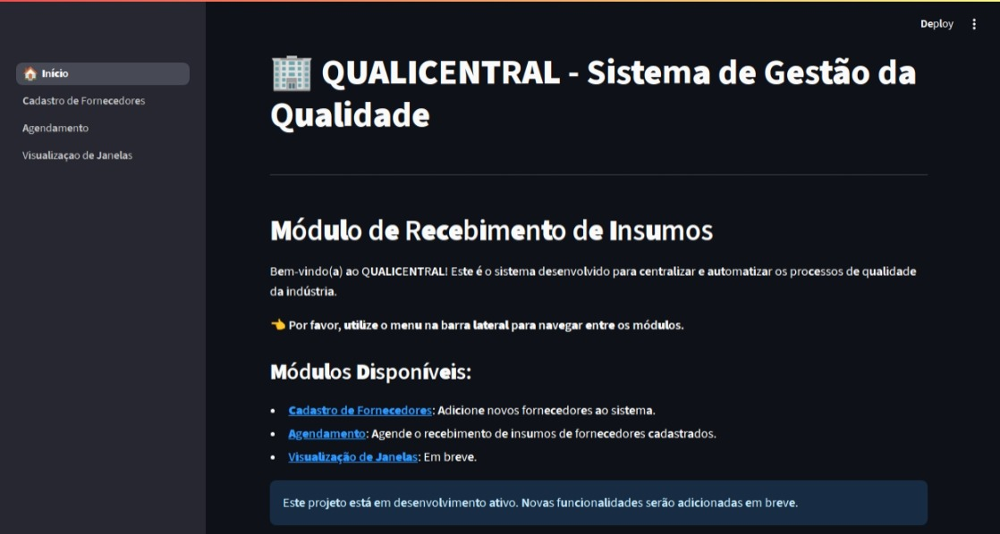
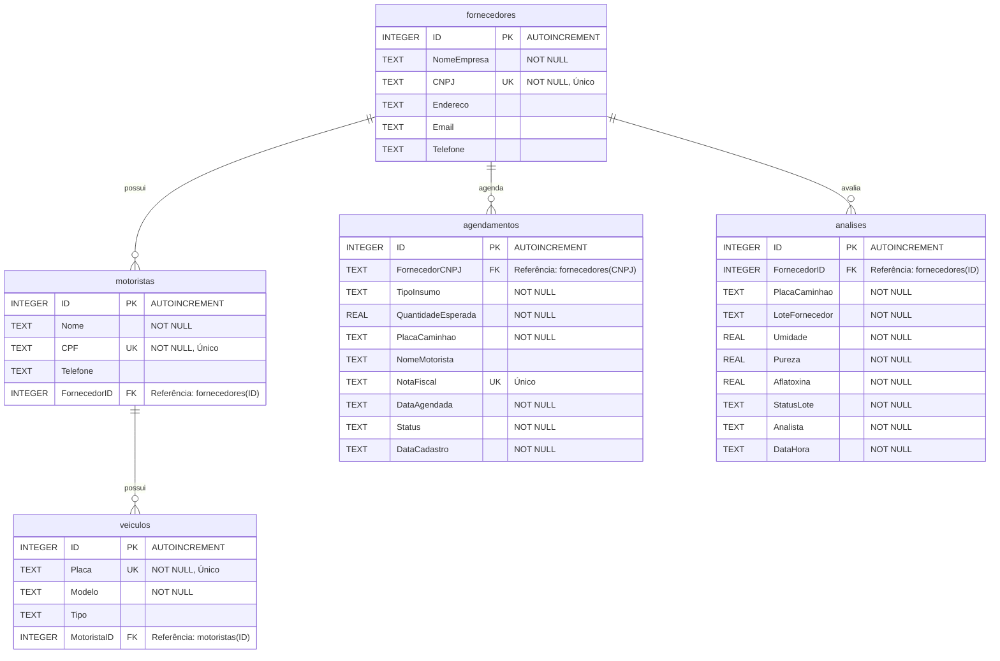

# 🏢 QUALICENTRAL - Sistema de Gestão da Qualidade

*Centralizando e automatizando processos de qualidade para o recebimento de insumos na indústria alimentícia.*

---

[](https://www.python.org/)
[](https://streamlit.io/)
[](https://www.sqlite.org/)
[](https://pandas.pydata.org/)

---

### 🚀 **Aplicação em Nuvem**

**[Acesse a aplicação em produção aqui!](https://sistemaqualidade.streamlit.app/)**

---

### 📸 **Interface do Usuário**



---

## 📝 Sobre o Projeto

O **QUALICENTRAL** é um sistema web desenvolvido para otimizar, padronizar e digitalizar o controle de qualidade no recebimento de insumos para indústrias (especialmente focado no setor de alimentos). 

O principal objetivo do sistema é substituir planilhas paralelas e controles em papel por um fluxo de trabalho digital único, integrado, centralizado e auditável. Ele gerencia desde o cadastro de parceiros (fornecedores) e seus recursos logísticos (motoristas/veículos) até os agendamentos e a posterior emissão de laudos de não conformidade no recebimento.

---

## 🗺️ Roadmap de Módulos e Funcionalidades

Abaixo está o status atual do desenvolvimento do sistema:

- [x] **Módulo 1: Cadastro de Fornecedores:** Registro de parceiros comerciais com validação contra duplicidade de CNPJ.
- [x] **Módulo 2: Motoristas e Veículos:** Vínculo de motoristas e veículos aos seus respectivos fornecedores para fins de controle de acesso e segurança.
- [x] **Módulo 3: Agendamento de Entregas:** Agendamento de cargas informando insumo, volume estimado, placa do veículo, motorista, nota fiscal única e data de entrega.
- [x] **Módulo 4: Análise de Recebimento:** Testes de qualidade físico-química dos insumos e classificação automática (Motor de Decisão) no ato do recebimento.
- [ ] **Módulo 5: Painel Interno / Visualização de Janelas (Em Desenvolvimento):** Dashboard operacional para a portaria/qualidade gerenciar a fila e o status das descargas.
- [ ] **Módulo 6: Registro de Não Conformidades (Planejado):** Geração automática de laudos e alertas de desvio de qualidade com envio de e-mail/WhatsApp.

---

## 🗄️ Arquitetura do Banco de Dados

A aplicação utiliza um banco de dados **SQLite** (`fornecedores.db`) local com chaves estrangeiras e regras de integridade relacional.

### Diagrama Entidade-Relacionamento (ERD)



### Regras de Integridade
* **CNPJ Duplicado:** Bloqueado no cadastro de novos fornecedores.
* **CPF do Motorista:** Cada motorista cadastrado possui CPF único, impedindo registros duplicados no sistema.
* **Placa de Veículo:** Placa única em todo o sistema. A placa inserida no formulário é convertida automaticamente para letras maiúsculas.
* **Nota Fiscal:** Cada agendamento exige uma Nota Fiscal de número exclusivo para evitar agendamentos em duplicidade.

---

## 📂 Estrutura de Arquivos

```
Sistema_Qualidade/
│
├── 0_🏠_Início.py               # Página principal do Streamlit (dashboard/painel de boas-vindas)
│
├── pages/                      # Páginas secundárias que compõem a aplicação multi-page
│   ├── 1_Cadastro de Fornecedores.py  # Módulo de cadastro e listagem de fornecedores
│   ├── 2_Motoristas e Veículos.py     # Gestão operacional de motoristas e frotas dos fornecedores
│   ├── 3_Agendamento.py               # Formulário de reservas de recebimento e controle de notas
│   ├── 4_Visualização de Janelas.py   # Painel de visualização operacional de agendamentos reais
│   └── 5_Análise de Recebimento.py    # Módulo de análise físico-química com Motor de Decisão
│
├── fornecedores.db             # Arquivo SQLite gerado automaticamente ao rodar a app
├── inserir_dados.py            # Script automatizado para popular o banco com dados de teste
├── requirements.txt            # Dependências em Python necessárias para execução
└── README.md                   # Documentação oficial do projeto (este arquivo)
```

---

## 🛠️ Detalhamento dos Módulos e Funcionalidades

### 🏠 0. Início
Página de entrada da aplicação que apresenta a proposta de valor do sistema e funciona como um painel central de direcionamento para o usuário, contendo links de navegação.

### 📦 1. Cadastro de Fornecedores
* **Formulário de Entrada:** Coleta o Nome da Empresa, CNPJ, Telefone de contato, Endereço e E-mail.
* **Validação:** Exige que todos os campos sejam preenchidos e faz uma consulta prévia no banco de dados SQLite para garantir que o CNPJ seja único.
* **Visualização:** Mostra a lista completa de fornecedores cadastrados na base de dados de forma tabulada (usando `st.dataframe`) com um indicador informativo do total de registros.
* **Reset manual:** Botão "🧹 Limpar Dados / Resetar" para reiniciar o formulário a qualquer momento.

### 🚗 2. Motoristas e Veículos
* **Hierarquia Operacional:** Primeiro seleciona-se o fornecedor. Ao fazer isso, o sistema filtra e apresenta a lista de motoristas já cadastrados para aquela empresa parceira.
* **Cadastro de Motoristas:** Formulário interno (expansível) para cadastrar novos motoristas sob a chancela do fornecedor selecionado. Valida CPFs exclusivos.
* **Vínculo de Veículos:** Permite que o operador selecione um motorista específico da tabela e gerencie seus veículos (como cavalos mecânicos e carretas), vinculando a placa, modelo e tipo de veículo (ex: Bitrem, Vanderleia, LS).

### 📅 3. Agendamento de Entregas
* **Identificação:** Seletor dinâmico que exibe os fornecedores cadastrados com nome e CNPJ formatados.
* **Dados Operacionais:** Cadastro do tipo de insumo (ex: Milho, Soja), volume esperado em Kg, dados do transporte (Placa e Nome do Motorista), número da Nota Fiscal única e data agendada para recebimento.
* **Fluxo de Trabalho:** O agendamento é registrado com o status inicial de `Pendente` e armazena o carimbo de data/hora (`DataCadastro`) no momento da submissão.

### 👁️ 4. Visualização de Janelas
* **Leitura em Tempo Real:** Exibe o volume total e os veículos programados para entrega consultados dinamicamente do banco de dados SQLite.
* **Painel Operacional:** Permite monitorar a fila de recebimento e os status de portaria.

### 🧪 5. Análise de Recebimento
* **Parâmetros Coletados:** Permite que o Analista de Qualidade insira o teor de Umidade (%), a Pureza (%) e a Aflatoxina (ppb) da carga de grãos na doca.
* **Motor de Decisão Automático:** O sistema compara os dados físicos e químicos instantaneamente com os limites tolerados pela indústria:
  * **Umidade:** Aprovado $\le 14\%$, Restrição $\le 15\%$, Reprovado $> 15\%$.
  * **Pureza:** Aprovado $\ge 98\%$, Restrição $\ge 97\%$, Reprovado $< 97\%$.
  * **Aflatoxina:** Aprovado $\le 20\text{ ppb}$, Reprovado $> 20\text{ ppb}$ (toxina nociva).
* **Feedback Imediato & Histórico**: Apresenta painel colorido do laudo gerado e lista as últimas análises realizadas no dia com gravação de data/hora e analista responsável.

---

## 🚀 Como Executar o Projeto Localmente

Siga o passo a passo abaixo para configurar a aplicação em sua máquina local.

### Pré-requisitos
* Python 3.8 ou superior instalado.
* Gerenciador de pacotes `pip`.

### Configuração do Ambiente

1. **Clone o repositório:**
   ```bash
   git clone https://github.com/Laianne27/Sistema_Qualidade.git
   cd Sistema_Qualidade
   ```

2. **Crie um ambiente virtual (venv):**
   ```bash
   # Linux/macOS
   python3 -m venv .venv

   # Windows
   python -m venv .venv
   ```

3. **Ative o ambiente virtual:**
   ```bash
   # Linux/macOS
   source .venv/bin/activate

   # Windows (Command Prompt)
   .venv\Scripts\activate.bat

   # Windows (PowerShell)
   .venv\Scripts\Activate.ps1
   ```

4. **Instale as dependências:**
   ```bash
   pip install -r requirements.txt
   ```

5. **(Opcional) Instale o Faker para dados de teste:**
   Se você quiser popular o banco com dados de teste fictícios, instale a biblioteca Faker (caso contrário, o próprio script `inserir_dados.py` fará a instalação automatizada na primeira execução):
   ```bash
   pip install Faker
   ```

---

## ⚡ Popular o Banco com Dados de Teste

Para facilitar testes operacionais locais e simulações, o projeto inclui um script gerador de dados automatizado (`inserir_dados.py`). Ele insere automaticamente **3 motoristas com telefones formatados** e **1 veículo para cada motorista** em todos os fornecedores já cadastrados na sua base.

**Como rodar o gerador:**
```bash
python inserir_dados.py
```
O console exibirá as informações inseridas em tempo real.

---

## 🏃 Executando a Aplicação Streamlit

Com o ambiente ativado e as dependências instaladas, inicialize o servidor local do Streamlit:

```bash
streamlit run 0_🏠_Início.py
```

O Streamlit iniciará um servidor web local e abrirá automaticamente seu navegador padrão no endereço:
* Local: `http://localhost:8501`

> [!NOTE]
> O arquivo do banco de dados SQLite (`fornecedores.db`) será criado e configurado automaticamente na raiz do projeto na primeira vez que a aplicação for iniciada e um módulo interativo for acessado.
